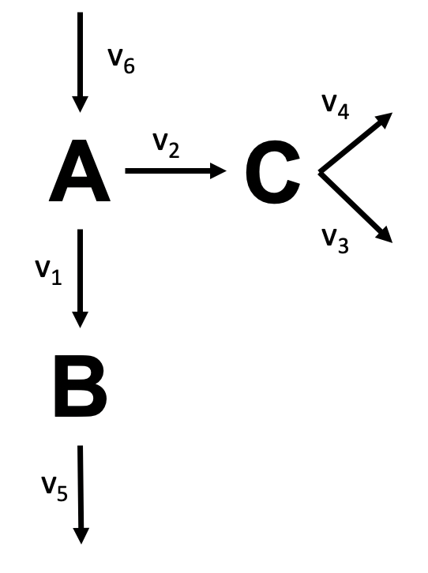

# Metabolic Flux Analysis - Assignment

In `assignment.py`:

1. Encode the network's stoichiometry as a stoichiometry matrix.
2. Calculate the degrees of freedom using numpy.
3. Calculate fluxes based on measured fluxes.

Hints:
* $\mathbf{v}_c = -\mathbf{S}_c^{-1} \mathbf{S}_m \mathbf{v}_m$
* `numpy.linalg.matrix_rank`, `numpy.linalg.inv`